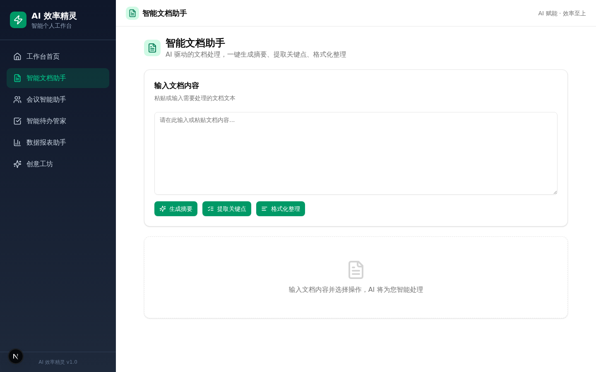
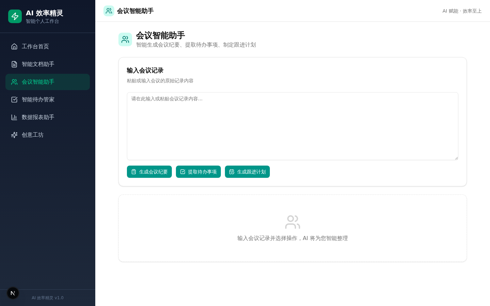
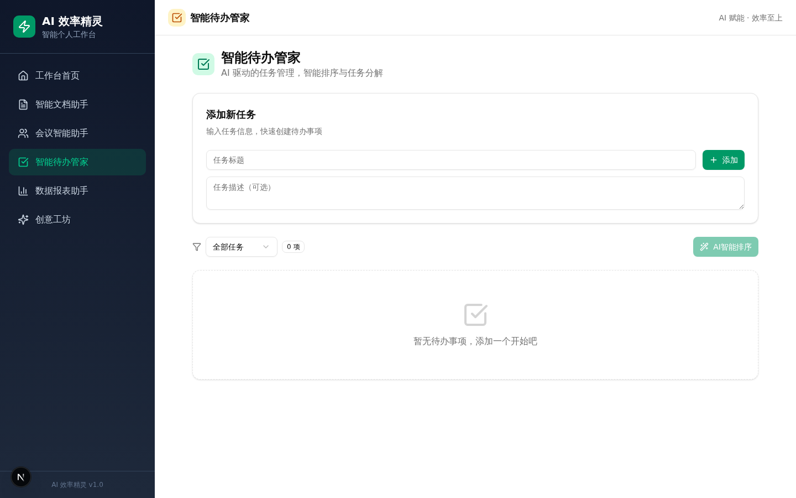
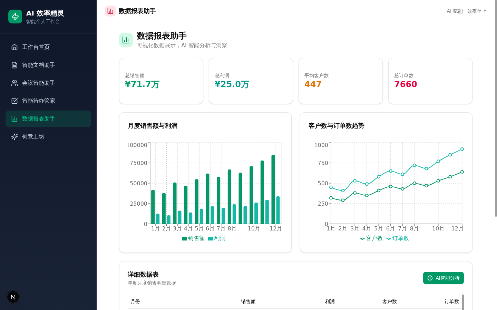
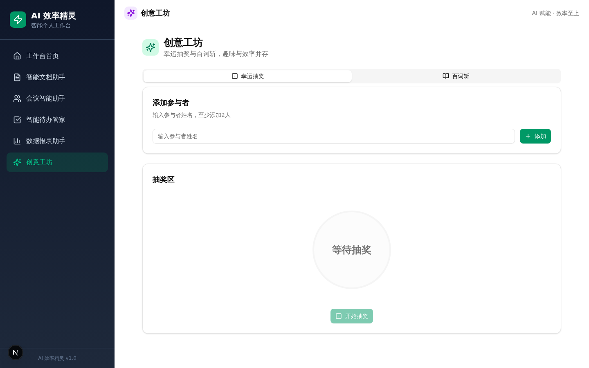
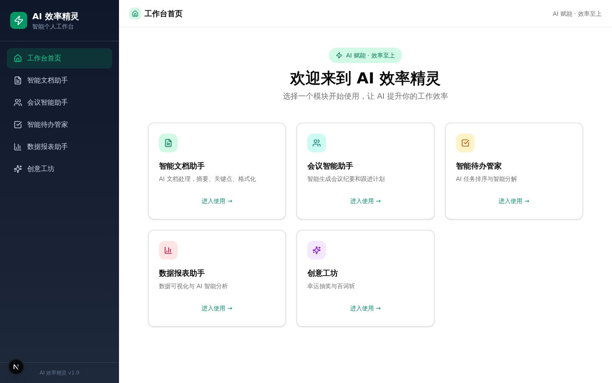
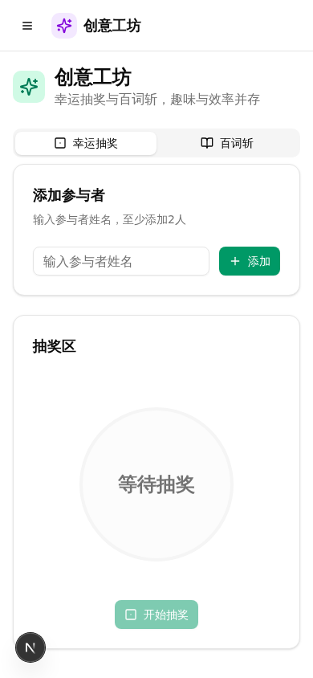

# AI 效率精灵 - 智能个人工作台

<p align="center">
  <strong>AI 赋能 · 效率至上</strong>
</p>

<p align="center">
  
  
  
  
  
</p>

---

## 项目简介

**AI 效率精灵** 是一款基于 AI 大模型的智能个人工作台，融合了**效率提升工具**、**个人助理**和**创意作品**三大方向，旨在用 AI 赋能每一个有创意的个体。无论你是开发老手还是编程新手，都能在 AI 的辅助下实现自己的创意想法。

### 核心亮点

- **全 AI 驱动**：5 大功能模块均集成 AI 大模型能力，实现智能化操作
- **开箱即用**：无需复杂配置，一键启动即可使用全部功能
- **精美 UI**：基于 shadcn/ui 组件库，翡翠绿主题色系，现代感十足
- **响应式设计**：完美适配桌面端和移动端
- **数据持久化**：基于 Zustand + localStorage，刷新不丢失数据

---

## 功能模块

### 1. 智能文档助手 📝

> 赛题方向：效率提升工具

AI 驱动的文档处理工具，一键完成繁琐的文档整理工作。

- **生成摘要**：自动提取文档核心内容，生成精炼摘要
- **提取关键点**：智能识别文档关键信息，以编号列表呈现
- **格式化整理**：自动整理文档结构，输出清晰 Markdown 格式



### 2. 会议智能助手 🗓️

> 赛题方向：效率提升工具

让 AI 成为你的会议记录员和跟进管家。

- **生成会议纪要**：自动将杂乱的会议记录整理为结构化纪要
- **提取待办事项**：从会议内容中提取行动项、负责人和截止日期
- **生成跟进计划**：智能制定后续跟进计划和下次会议建议



### 3. 智能待办管家 ✅

> 赛题方向：个人/团队助理

AI 贴心管家，让任务管理更智能、更高效。

- **任务管理**：添加、完成、删除待办事项
- **AI 智能排序**：根据重要性和紧急性自动排列优先级
- **AI 任务分解**：将复杂任务拆解为可执行的子任务
- **状态筛选**：按全部/进行中/已完成筛选查看



### 4. 数据报表助手 📊

> 赛题方向：效率提升工具

数据可视化与 AI 智能分析，让数据会说话。

- **数据概览**：关键指标统计卡片一目了然
- **可视化图表**：柱状图展示销售额与利润，折线图展示客户与订单趋势
- **详细数据表**：完整的月度销售明细数据
- **AI 智能分析**：一键获取数据洞察、趋势分析和改进建议



### 5. 创意工坊 🎲

> 赛题方向：创意作品

趣味与效率并存，AI 创意玩法。

#### 幸运抽奖 🎰
- 添加参与者名单
- 动画抽奖效果
- 中奖记录自动保存

#### 百词斩 📖
- AI 生成英语词汇测试题
- 四选一答题模式
- 得分与连击计数
- 错题本自动收录，支持复习



---

## 界面展示

### 工作台首页



### 移动端适配



---

## 技术架构

### 技术栈

| 技术 | 版本 | 用途 |
|------|------|------|
| Next.js | 16 | 全栈 React 框架 |
| TypeScript | 5 | 类型安全 |
| Tailwind CSS | 4 | 原子化样式 |
| shadcn/ui | New York | UI 组件库 |
| Zustand | 5 | 客户端状态管理 |
| Recharts | 2 | 数据可视化图表 |
| z-ai-web-dev-sdk | latest | AI 大模型集成 |
| react-markdown | 10 | Markdown 渲染 |
| Sonner | 2 | Toast 通知 |
| Lucide React | latest | 图标库 |

### 项目结构

```
src/
├── app/
│   ├── api/
│   │   └── ai/
│   │       └── route.ts          # AI 统一接口
│   ├── globals.css               # 全局样式与主题
│   ├── layout.tsx                # 根布局
│   └── page.tsx                  # 主页面（含侧边栏导航）
├── components/
│   ├── modules/
│   │   ├── DocumentAssistant.tsx  # 智能文档助手
│   │   ├── MeetingAssistant.tsx   # 会议智能助手
│   │   ├── TodoManager.tsx        # 智能待办管家
│   │   ├── DataReport.tsx         # 数据报表助手
│   │   └── CreativeWorkshop.tsx   # 创意工坊（抽奖+百词斩）
│   └── ui/                        # shadcn/ui 组件库
├── lib/
│   ├── store.ts                   # Zustand 状态管理
│   ├── utils.ts                   # 工具函数
│   └── db.ts                      # Prisma 数据库
└── hooks/                         # 自定义 Hooks
```

### 架构设计

```
┌─────────────────────────────────────────────────────┐
│                    前端 (Next.js)                      │
│  ┌─────────┐ ┌─────────┐ ┌─────────┐ ┌─────────┐   │
│  │ 文档助手 │ │ 会议助手 │ │ 待办管家 │ │ 报表助手 │   │
│  └────┬────┘ └────┬────┘ └────┬────┘ └────┬────┘   │
│       │           │           │           │          │
│  ┌────┴───────────┴───────────┴───────────┴────┐   │
│  │              Zustand State Store              │   │
│  │          (persist / localStorage)             │   │
│  └──────────────────┬──────────────────────────┘   │
│                     │                               │
│  ┌──────────────────┴──────────────────────────┐   │
│  │             /api/ai (Route Handler)          │   │
│  │          z-ai-web-dev-sdk 统一调用            │   │
│  └──────────────────┬──────────────────────────┘   │
└─────────────────────┼───────────────────────────────┘
                      │
              ┌───────┴───────┐
              │   AI 大模型    │
              │  (ChatGLM)    │
              └───────────────┘
```

---

## 快速开始

### 环境要求

- Node.js >= 18
- bun >= 1.0（推荐）

### 安装步骤

```bash
# 克隆项目
git clone https://github.com/Vincent-zwc/ai-efficiency-spirit.git
cd ai-efficiency-spirit

# 安装依赖
bun install

# 启动开发服务器
bun run dev

# 在浏览器打开 http://localhost:3000
```

### 构建部署

```bash
# 构建生产版本
bun run build

# 启动生产服务器
bun run start
```

> 详细的部署指南请查看 [DEPLOYMENT.md](docs/DEPLOYMENT.md)

---

## AI 能力说明

本项目使用 `z-ai-web-dev-sdk` 接入 AI 大模型，所有 AI 调用均通过后端 API 路由 (`/api/ai`) 完成，确保 API Key 安全。每个模块针对不同场景使用定制化的系统提示词（System Prompt）：

| 模块 | AI 能力 | 系统提示词 |
|------|---------|-----------|
| 智能文档助手 | 摘要/关键点/格式化 | 专业文档处理助手 |
| 会议智能助手 | 纪要/待办/跟进 | 专业会议助手 |
| 智能待办管家 | 优先级排序/任务分解 | 任务管理/项目管理助手 |
| 数据报表助手 | 数据洞察/趋势分析 | 数据分析助手 |
| 创意工坊-百词斩 | 题目生成 | 英语教学助手 |

---

## 赛题对应

| 赛题方向 | 对应模块 | 具体功能 |
|---------|---------|---------|
| 效率提升工具 | 智能文档助手 | 文档处理器：自动生成摘要、提取关键点、格式化整理 |
| 效率提升工具 | 会议智能助手 | 会议智能助手：智能纪要、待办提取、跟进计划 |
| 效率提升工具 | 数据报表助手 | 数据报表智能助手：可视化+AI分析 |
| 个人/团队助理 | 智能待办管家 | 个人工作管家：任务管理、AI优先级排序、智能分解 |
| 创意作品 | 创意工坊-幸运抽奖 | 抽奖系统：动画抽奖、历史记录 |
| 创意作品 | 创意工坊-百词斩 | 百词斩：AI出题、答题、错题系统 |

---

## License

MIT License

---

<p align="center">
  Made with ❤️ and AI
</p>
